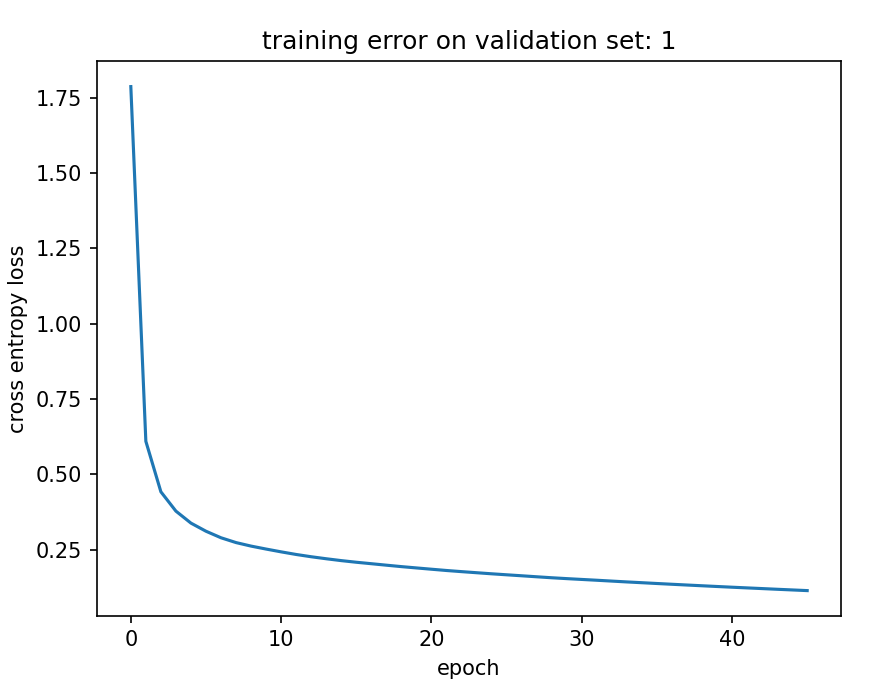
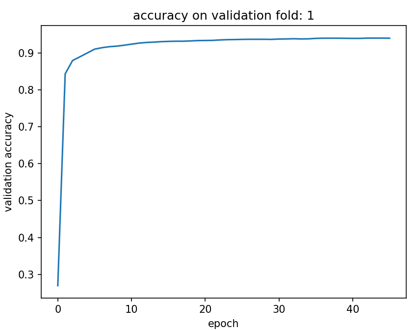
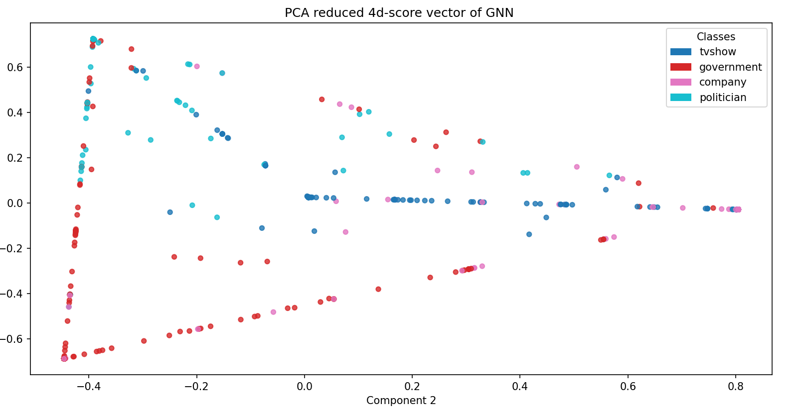

GNN Facebook Page Classifier 

Data Preprocessing
The preprocessing pipeline first loads and structures the Facebook page graph. Each page is a node with a 4714-dimensional binary feature vector, and edges represent mutual page likes. The loader reads the edge list, target labels, and feature JSON, converts them into PyTorch tensors, and ensures edges are bidirectional so the graph is undirected. Labels are mapped into integer classes (tvshow, government, company, politician), and each node’s features are set in a dense tensor where active feature indices are 1.

To support node-level K-fold cross-validation, the KFoldGraphCV class splits the nodes into 90% training and 10% testing. For each fold, it creates a full graph where the features of validation (and test) nodes are zeroed out while keeping them connected in the graph. This design allows the GNN to infer node classes based purely on neighborhood information rather than their own features, providing a more realistic measure of generalization.

Defining 
Module.py defines a Graph Neural Network (GNN) for node classification on the Facebook page graph. Each node’s 4714-dimensional binary feature vector is first compressed to 128 dimensions (with a learned linear layer), then passed through three GCN layers with LeakyReLU activations and batch normalization. A zero-mask ensures nodes with no active features (e.g., validation/test nodes) don’t contribute spurious signals during message passing. The network outputs logits for four classes: tvshow, government, company, and politician.

Training
The train.py trains an ensemble GNN with different validation folds 
Training is handled through a custom validate() function that performs optimization, validation, and early stopping. The script uses the KFoldGraphCV loader to build five training folds, training a separate GNN per fold to form an ensemble. Each fold’s validation nodes have their features zeroed, forcing the model to predict based purely on graph structure. Cross-entropy loss and classification accuracy are computed per fold, and progress is printed after each epoch until convergence. It then saves the ensemble of GNNs to the directory 

Predicting
The predict.py module performs inference using the trained GNN ensemble. Each model in the ensemble predicts class probabilities for all nodes via softmax, and the results are averaged to form a combined prediction. The final class label for each node is the argmax of these averaged probabilities. The script also includes a calc_test_score() function that evaluates the ensemble’s accuracy on the held-out test nodes, providing a final performance metric after training. It loads the trained ensemble and does some predictions on the test nodes showing prediction from actual targets.

The Whole pipeline
There is a main.py option if you want to do everything all in one go training and then calculating test scores
Basicly its my test driver script.

Network Architecture 
so feature compressing layer which was learned dimensionality reduction that takes a 4714-dimensional binary feature vector to a 128 dimensional vector. Now that we have these compressed feature vectors. I then apply 3 
GCN layers to the Graph which is GCN(X,Edges), s.t X = (num_nodes, 128) and Edges (num_edges,2) and that for (node_id1,node_id2) in Edges, node1_features = X(node_id1) , node2_features = X(node_id2). a GCN basicly aggregates messages by edge connections look at this node_h1 = w1*x_neighbor1 + ...+ wn*x_neighbor2 then activation function node_h1 = leaky_RELU(node_h1) .Then I do two more of these GCN convolutions which is node_h2 = w1*h1_neighbor1 +...+ wn*h1_neighbor2. Finally our node_h_out is a vector of size 4 which represents logits in the softmax function.  

Results

final validation accuracy on fold 1: 0.9401730298995972
final loss on K-fold training set 1: 0.11442960053682327

final validation accuracy on fold 2: 0.941409170627594
final loss on K-fold training set 2: 0.1093902736902237

final validation accuracy on fold 3: 0.9381952881813049
final loss on K-fold training  set 3: 0.12020231038331985

final validation accuracy on fold 4: 0.9381800293922424
final loss on K-fold training set 4: 0.1312509924173355

final validation accuracy on fold 5: 0.9389218688011169
final loss on K-fold training set 5: 0.10936744511127472

Final Test Accuracy: 0.9492656588554382

Some Test Predictions on unseen nodes:

for facebook page node id: 5154
page type: tvshow predicted page type: tvshow

for facebook page node id: 5394
page type: tvshow predicted page type: tvshow

for facebook page node id: 10857
page type: tvshow predicted page type: tvshow

for facebook page node id: 20006
page type: politician predicted page type: politician

for facebook page node id: 7736
page type: politician predicted page type: company

for facebook page node id: 3206
page type: company predicted page type: company

for facebook page node id: 6778
page type: company predicted page type: company

for facebook page node id: 20378
page type: government predicted page type: politician

for facebook page node id: 12579
page type: politician predicted page type: politician

for facebook page node id: 4268
page type: company predicted page type: company

So it seemed to confused politician and government facebook pages. 
Which actually makes sense when you think about it politicians are probably going
to have a lot mutual likes with government pages.

example plot

This last plot shows the dimension reduced score vector (logits) of each face book page
this is for unseen Test nodes so the ensemble of GNNs this is basicly the transformation the 
GNN learned 

Also for more of these plots check the images directory!